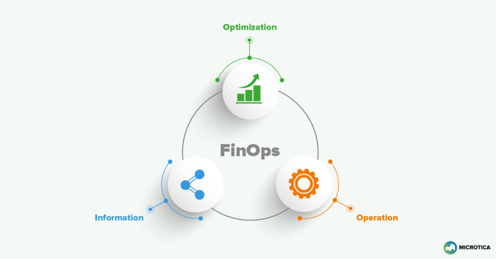

# FinOps-tutorial

 

## Published articles:

 - [FinOps Tutorial - Part 1 - AWS Non Office time](https://medium.com/@ahmadalibagheri2010/finops-part-1-non-office-time-c9ccce5dab8)

 - [FinOps Tutorial - Part 2 - AWS Instance Type]() InProgress

 - [FinOps Tutorial - Part 3 - AWS Spot and On Demand]() InProgress

## Contributions:

All contributions are welcomed. Help me to enrich this repository.

If you find any **bugs** in the examples, please file an issue.

### TODO:

 - [ ] Adding FinOps Hidden coste
 - [ ] Adding FinOps Using customize serivces

