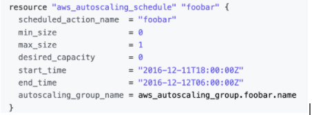

<h1 style="color:yellowgreen">
What is FinOps and Why do you need it?
</h1>

As a Senior DevOps Engineer, I think DevOps has 3 legs. 

- Development
- Operations
- Business

Yes Business, we need to think about the business and all hidden costs.
With a good strategy, we can reduce all the hidden costs, and then DevOps can do some magical things and save lots of money. 

Before talking about the strategies we need to talk about environments
Consider we have 4 environments here 

- Dev
- QA
- Pre-Prod
- Prod

Some companies do not like Pre-Prod but in my opinion, it’s great because the business team can check all the aspects and approve all changes, and then we can work on Prod.
So let’s get started!
<h1 style="color:yellowgreen">
First Strategy: Non-Office time
</h1>

Do we have to pay for nights too?

During non-official times, we always pay for some resources that we do not use! Yes, and this is not just a little money? consider you have 3 environments like Dev, QA, PreProd and Maybe you have more than 50 resources! You pay for nothing during the non-office time!
How can we manage it? It’s so easy, we can make a schedule in our resource so all the resources will terminate at the end of the day, and they will be created tomorrow before office time. All automated! 

With this strategy, we can save more than 5000 euros per month 
5000 * 12 = 60,000 €
a senior DevOps salary =~  60,000 - 70000 €
So we can hire a new high-tech engineer in our team with only 8 commands!

### Refrence

https://registry.terraform.io/providers/hashicorp/aws/latest/docs/resources/autoscaling_schedule
