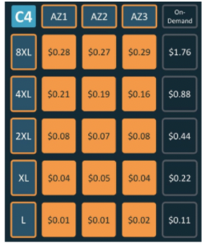

Hi there, hope you all are well enough and you did the last two strategies in your environments.

Ok so we have learned 

How to manage our resources in the none office time from this link 
How to choose the best resource for our infrastructure from this link 

So let’s go for the third strategy 

<h1 style="color:yellowgreen">
Spot Or On-Demand?
</h1>

When we are talking about our environment, we need to categorize them first. 
Which one is critical? Ok it’s obvious and its Prod 

But what about Dev,QA , Pre Prod?
When we are talking about orchestration it means there is no data in our cloud-native and you can find just some codes there.

So what if we choose some cheap servers?
What if we go for an 8XL server with 0.28$ instead of 1.76$?
It’s cheaper but there is something that you need to know!




<h1 style="color:yellowgreen">
What is Spot in AWS ?
</h1>

On-demand server means you rent a specific amount of resource and you have to pay it and AWS guaranteed that this resource is available for you but we know all the time there is some unused EC2 capacity in the AWS ! yea this is Spot.

This resources are cheaper than On-demand but if AWS wants to use this resource the price is changing and maybe you lose the server. Ok that’s fair enough so when it’s good to use Spot servers?

For 
- Data analysis 
- Batch jobs 
- Background processing 
- Running Kubernetes for all environments except PROD


The Hourly price for Spot instances varies based on demand which means it’s really hard to say this server is always with a specific price and for saving your money you can manage your budget and say ok if the price for this spot server goes more than something, stop requesting!

Look at this code on terraform for AWS 

```
# Request a spot instance at $0.03
resource "aws_spot_instance_request" "cheap_worker" {
  ami           = "ami-1234"
  spot_price    = "0.03"
  instance_type = "c4.xlarge"

  tags = {
    Name = "CheapWorker"
  }
}

```


When we are talking about spot_price it means the maximum price to request on spot market .

There is a good option here and it’s a combination with the first strategy!


- `valid_until`  (Optional) The end date and time of the request, in UTC RFC3339 format(for example, YYYY-MM-DDTHH:MM:SSZ). At this point, no new Spot instance requests are placed or enabled to fulfill the request. The default end date is 7 days from the current date.

- `valid_from` (Optional) The start date and time of the request, in UTC RFC3339 format(for example, YYYY-MM-DDTHH:MM:SSZ). The default is to start fulfilling the request immediately.


`Valid_from `and `Valid_until` it means you can schedule it to have these resources in the specific duration.


<h1 style="color:yellowgreen">
There is one more useful option and it’s spot-type 
</h1>


If you set spot_type to one-time it will never request another resource whenever the insurance terminates but by default it's enabled and it’s set to persistent and it means as the price is lower than our spot_price, we will have the resource.

[Refrence](https://registry.terraform.io/providers/hashicorp/aws/latest/docs/resources/spot_instance_request)

