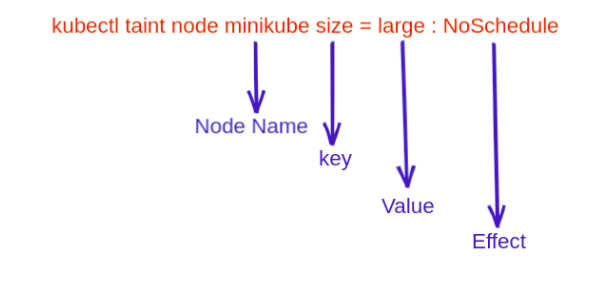

<h1 style="color:yellowgreen">
How save Money with Kubernetes magics
</h1>
Hi
today we want to do some magic with Kubernetes.

most of the time we saw they've used same resources for all services in the Kubernetes cluster!!!
in this moments we see they've chosen some big servers for infrastructure and obviously they have to pay a lot for them!

we do not need same resources for all the services in our cluster! for example when you want to configure a Hashicorp Consul, you do not need to pay for an 8xl server because this service is not so big! or maybe you are paying for a big resource for corresponding purpose but other pods are in that resource and this is not so cool for you .so what should we do now?


first you need to have a table to list all the services and recommendation resource for them!
then we go for Tainted and Toleration and node-selector!

first you need to taint a node and then you can do toleration to corresponding pods.

taint are for the nodes and toleration is for pods 

for example to add a taint to a node:
نر

` kubectl taint node <Node_Name> <key=value:TAINT_EFFECT> `


` kubectl taint nodes node1 key1=value1:NoSchedule `

places a taint on node node1. The taint has key key1, value value1, and taint effect NoSchedule. This means that no pod will be able to schedule onto node1 unless it has a matching toleration.

To remove the taint added by the command above, you can run:

` kubectl taint nodes node1 key1=value1:NoSchedule- `




<h2 style="color:yellowgreen">
Taint Effects
</h2>

There are three type’s of taint effect which we can apply to a node and 
1- NoSchedule
If we apply this taint effect to a node then it will only allow the pods which have a toleration effect equal to NoSchedule. But if a pod is already scheduled in a node and then you apply taint to the node having effect NoSchedule, then the pod will remain scheduled in the node.

2- PreferNoSchedule
In this effect, it will first prefer for no scheduling of pod but if you have a single node and a PreferNoSchedule taint is applied on it. Then even if the pod didn’t tolerate the taint it will get schedule inside the node which has a taint effect: PreferNoSchedule.

3- NoExecute
This effect will not only restrict the pod to get scheduled in the node but also if a pod is already scheduled a specific node and we have applied a taint of effect NoExecute to the specific node, it will immediately throw out the pod outside the node.


what about pods? you specify a toleration for a pod in the PodSpec and now you are telling the Node to do not repel this pod because it has the correct authority for this node.

``` 
tolerations:
- key: "key1"
  operator: "Equal"
  value: "value1"
  effect: "NoSchedule"
```

ok now we have four new keywords
this is the code that we have used it in the top for tainting the node

` kubectl taint nodes node1 key1=value1:NoSchedule `

key :  key1 is our key 
value : is the value of the key 
effect : NoSchedule, like the taint 
operate : you can use `Equal` or `Exists`

if you go for Equal, it means you have to specify all the key and value and effect part but if you want your pods tolerate on every nodes you can use `Exists`


[ example 1 ](example-of-pod-toleratoin.yaml)
[ example 2 ](example2-toleration.yaml)


<h2 style="color:yellowgreen">
what if we want to specify a pod only on one specific node in our Taint and Toleration?
</h2>
now we can use `node selector` and it's so easy. first you need to set a label on that nodes 

`kubectl label nodes <node-name> <label-key>=<label-value>`


`kubectl lable nodes node1 size=large`

and now you can specify it in your PodSpec 
```
 spec:
      containers:
      - name: nginx-container
        image: nginx
        ports:
        - containerPort: 80
      tolerations:
      - key: size
        operator: "Equal"
        value: large
        effect: NoExecute
      nodeSelector:
        size: large
```


[Refrence1](https://kubernetes.io/docs/concepts/scheduling-eviction/taint-and-toleration/)
[Refrence2](https://kubernetes.io/docs/concepts/scheduling-eviction/assign-pod-node/)
[Refrence3](https://blog.opstree.com/2021/05/11/taints-and-tolerations-usage-with-node-selector-in-kubernetes-scheduling/#:~:text=Taint%20is%20a%20property%20of,to%20schedule%20inside%20that%20node.)
